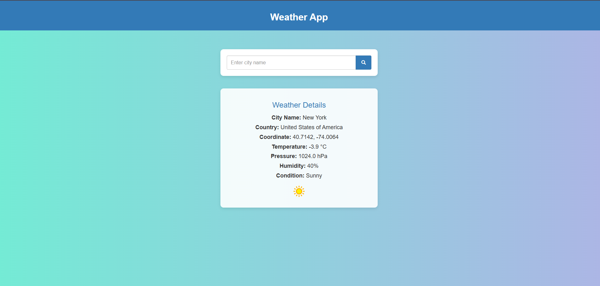

# 🌦️ Weather App  

A simple **Flask-based Weather App** that allows users to search for a city's weather and displays real-time weather details using the **WeatherAPI**.  

## 🚀 Features  
- ✅ Fetches real-time weather data  
- ✅ Displays temperature, humidity, pressure, and conditions  
- ✅ Responsive and clean UI with **pure CSS** (No Bootstrap)  
- ✅ Uses Flask backend with **WeatherAPI**  

---

## 📂 Project Structure  
/weather-app 
  │── /static │ 
    │── styles.css  
  │── /templates │ 
    │── index.html  
  │── app.py 
  │── requirements.txt
  │── README.md +

## 📸 Screenshot  
Here is a preview of the Weather App:  



### 1️⃣ **Clone the Repository**
```sh
git clone https://github.com/yourusername/weather-app.git
cd weather-app
```

### 2️⃣ **Create a Virtual Environment (Optional)**
```sh
python -m venv venv
source venv/bin/activate  
venv\Scripts\activate

```

### 3️⃣ Install Dependencies
```sh
pip install -r requirements.txt
```
### 4️⃣ Get a Free API Key from WeatherAPI
Go to https://www.weatherapi.com/
Sign up and get your free API key
Replace "your_weatherapi_key" in app.py with your actual key

### 5️⃣ Run the Flask App
```sh
python app.py
```
### 6️⃣ Open in Browser
Go to http://127.0.0.1:5000/ and search for any city's weather! 🌍🌤️
